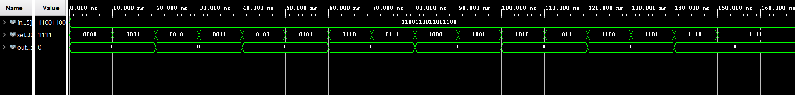
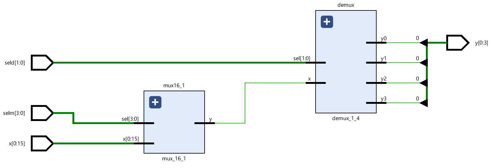
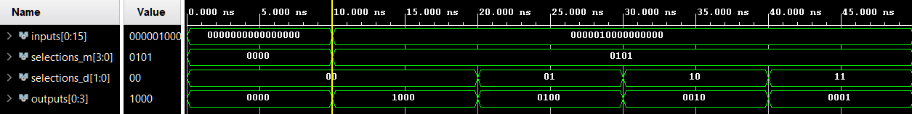

# Reti Combinatorie Elementari – Multiplexer e Rete 16:4

> Per una descrizione completa e formale del progetto fare riferimento alla documentazione:
> 
> **Capitolo 1 - Reti combinatorie elementari, Esercizio 1**.

Questo progetto fa parte del Capitolo 1: **Reti combinatorie elementari**, sviluppato in **VHDL** e testato tramite simulazione. Il progetto include:

## Esercizio 1.1 – Multiplexer 16:1

### Obiettivo

Progettare un multiplexer indirizzabile 16:1 utilizzando blocchi 4:1 preesistenti.

### Architettura

Strutturale a due livelli:

  1. **Primo livello**: quattro mux 4:1 elaborano gruppi di 4 bit del vettore di ingresso.
  2. **Secondo livello**: un mux 4:1 seleziona uno dei segnali intermedi.

### Simulazione

Testbench verificante tutte le possibili combinazioni di selezione. L’uscita segue correttamente il bit selezionato.
    
  

## Esercizio 1.2 – Rete di interconnessione 16:4

### Obiettivo

Realizzare una rete che collega 16 sorgenti a 4 destinazioni, combinando un multiplexer 16:1 e un demultiplexer 1:4.

### Architettura

Strutturale a due livelli:

  1. **Primo livello**: multiplexer 16:1 seleziona la sorgente attiva.
  2. **Secondo livello**: demultiplexer 1:4 instrada il segnale verso la destinazione scelta.
* **Selezioni**: `selm` (4 bit) per sorgente, `seld` (2 bit) per destinazione.
    
  

### Simulazione

Testbench verifica che l’uscita attiva sia esclusivamente quella indirizzata.

  

## Esercizio 1.3 – Sintesi su FPGA

### Obiettivo

Implementare la rete di interconnessione 16:4 sulla board **Nexys A7**.
* **I/O Board**:

  * Switch: input dei 16 bit (8 bit alla volta, gestiti tramite rete di controllo e due bottoni)
  * LED: visualizzazione dei 4 bit di uscita

<video width="640" height="480" controls>
  <source src="./assets/Rete_di_interconnessione_16-4.mp4" type="video/mp4">
  Il tuo browser non supporta il tag video.
</video>

https://github.com/user-attachments/assets/b294749e-b210-41cb-a342-0d7ab727feb4

---

**Note**:

* Tutti i moduli sono implementati in **VHDL**, con approccio strutturale.
* Per motivi accademici, i file VHDL non sono inclusi in questo repository pubblico.
* L’esercizio evidenzia la progettazione gerarchica e la simulazione di reti combinatorie su FPGA.

