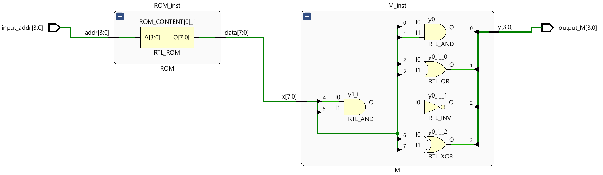
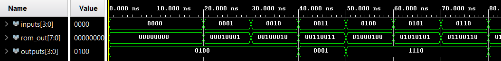

# Reti Combinatorie Elementari – Sistema ROM + M

> Per una descrizione completa e formale del progetto fare riferimento alla documentazione:
>
> **Capitolo 1 - Reti combinatorie elementari, Esercizio 2**.

Questo progetto fa parte del Capitolo 1: **Reti combinatorie elementari**, sviluppato in **VHDL** e verificato tramite simulazione.  
Il sistema realizza una catena **ROM → macchina combinatoria**, completamente combinatoria.

---

## Esercizio 2.1 – Sistema ROM + M

### Obiettivo

Progettare un **sistema S** composto da:
* una **ROM combinatoria** di 16 locazioni da 8 bit
* una **macchina combinatoria M** che trasforma un dato a 8 bit in un dato a 4 bit

Dato un indirizzo di 4 bit, il sistema restituisce il valore contenuto nella ROM opportunamente elaborato dalla macchina M.

### Architettura

Architettura **strutturale a due blocchi**:

1. **ROM combinatoria**
   * 16 locazioni da 8 bit
   * lettura puramente combinatoria
   * contenuto inizializzato direttamente nel codice VHDL

2. **Macchina combinatoria M**
   * ingresso: 8 bit provenienti dalla ROM
   * uscita: 4 bit
   * funzione realizzata tramite operazioni logiche (`AND`, `OR`, `NAND`, `XOR`) su coppie di bit dell’ingresso
     
      | Uscita | Operazione | Espressione logica |
      |:-----:|:----------:|:------------------:|
      | `y(3)` | XOR  | `x(6) xor x(7)` |
      | `y(2)` | NAND | `not (x(4) and x(5))` |
      | `y(1)` | OR   | `x(2) or x(3)` |
      | `y(0)` | AND  | `x(0) and x(1)` |

Il dato fluisce direttamente dalla ROM alla macchina M senza elementi di memoria intermedi.

  

### Simulazione

Il testbench verifica il corretto funzionamento del sistema provando **tutti gli indirizzi della ROM (0–15)**.  
Per ciascun indirizzo, l’uscita riflette correttamente la trasformazione applicata dalla macchina M al dato letto.

  

---

## Esercizio 2.2 – Sintesi su FPGA

### Obiettivo

Sintetizzare e implementare il sistema **ROM + M** su FPGA.

* **I/O Board**:
  * Switch: selezione dell’indirizzo della ROM
  * LED: visualizzazione dei 4 bit di uscita della macchina M

* **Verifica**:  
  Il valore visualizzato sui LED varia correttamente al variare dell’indirizzo selezionato sugli switch, confermando il corretto funzionamento dell’intero sistema.

<video width="640" height="480" controls>
  <source src="./assets/S.mp4" type="video/mp4">
  Il tuo browser non supporta il tag video.
</video>

https://github.com/user-attachments/assets/7002776e-9b73-4995-af68-69a17ae4d94b

---

**Note**:

* Tutti i moduli sono implementati in **VHDL**, con approccio strutturale.
* Per motivi accademici, i file sorgente VHDL non sono inclusi in questo repository pubblico.
* L’esercizio mostra la progettazione modulare di **reti combinatorie** e l’integrazione di ROM e logica combinatoria.

