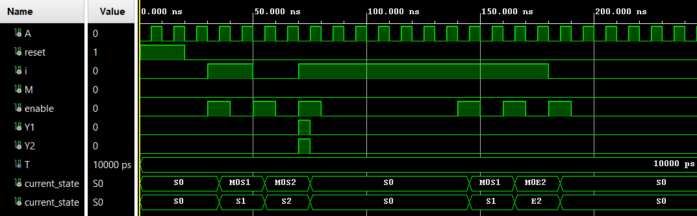
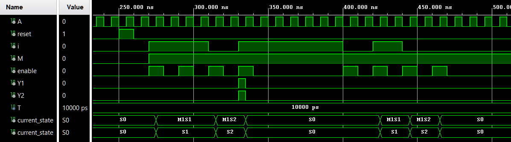

# Reti sequenziali elementari - Riconoscitore di sequenze

> Per una descrizione completa e formale del progetto fare riferimento alla documentazione:
> 
> **Capitolo 2 – Reti sequenziali elementari, Esercizio 3**.

## Descrizione
Questo esercizio riguarda la progettazione e implementazione in **VHDL** di una macchina sequenziale in grado di riconoscere la sequenza binaria **101**.  
La macchina opera su un flusso seriale di bit ed è controllata da un segnale di clock e da un segnale di modo che ne disciplina il comportamento.

## Specifiche funzionali
La macchina riceve in ingresso:
- `i`: ingresso seriale dei dati
- `A`: segnale di tempificazione (clock)
- `M`: segnale di modo
- `enable`: segnale di abilitazione dell’acquisizione

L’uscita `Y` viene attivata quando la sequenza **101** viene riconosciuta.

Il comportamento dipende dal valore del segnale `M`:
- **M = 0** → riconoscimento su gruppi di 3 bit **non sovrapposti**
- **M = 1** → riconoscimento **parzialmente sovrapposto**, con ritorno allo stato iniziale dopo ogni riconoscimento

## Architettura
La soluzione è basata su una **Finite State Machine (FSM) sincrona di tipo Mealy**, con:
- registro di stato aggiornato sul fronte di salita del clock `A`
- logica combinatoria per il calcolo dello stato successivo e dell’uscita

Sono state sviluppate **due architetture alternative**, entrambe conformi alla specifica:

### Soluzione 1 – FSM a 7 stati
- Separazione esplicita dei due modi di funzionamento
- Stati distinti per `M = 0` e `M = 1`
- Maggiore chiarezza semantica, a fronte di un numero maggiore di stati

### Soluzione 2 – FSM a 5 stati
- Architettura più compatta
- Riduzione del numero di stati e della complessità hardware

## Simulazione
La verifica funzionale è stata effettuata tramite simulazione VHDL utilizzando un **testbench comune** alle due soluzioni, applicando gli stessi stimoli di ingresso.  
Sono stati verificati:
- riconoscimenti corretti della sequenza `101`
- gestione di sequenze errate
- differenze di comportamento tra modalità sovrapposta e non sovrapposta

  
  

## Implementazione su board (Esercizio 3.2)
Il progetto è stato sintetizzato e implementato su FPGA utilizzando:
- uno switch per l’ingresso seriale `i`
- uno switch per la selezione del modo `M`
- due pulsanti per l’acquisizione sincronizzata degli ingressi
- un LED per la visualizzazione dell’uscita `Y`

Il segnale di clock è derivato dal clock di sistema della board.

<video width="640" height="480" controls>
  <source src="./assets/Riconoscitore.mp4" type="video/mp4">
  Il tuo browser non supporta il tag video.
</video>

https://github.com/user-attachments/assets/9f1a1786-770a-40c3-bdbe-f7c486557a03

---

**Note**:

* Tutti i moduli sono implementati in **VHDL**.
* Per motivi accademici, i file sorgente VHDL non sono inclusi in questo repository pubblico.