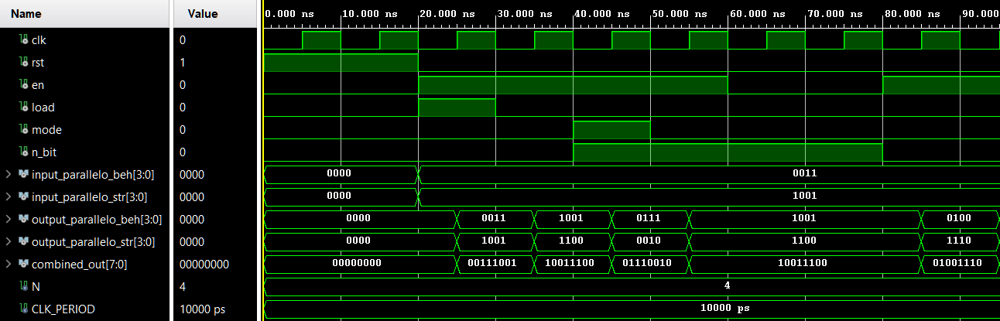

# Esercizio 4 – Shift Register

> Per una descrizione completa e formale del progetto fare riferimento alla documentazione:
>
> **Capitolo 2 – Reti sequenziali elementari, Esercizio 4**.

## Descrizione
L’esercizio prevede la progettazione, l’implementazione in **VHDL** e la verifica tramite simulazione di un **registro a scorrimento parametrico a N bit**, in grado di effettuare shift a destra o a sinistra di **1 o 2 posizioni**, selezionabili dall’utente tramite segnali di controllo.

Il numero di bit del registro è definito tramite **generic**, mentre la modalità di funzionamento è controllata dai segnali `mode` e `n_bit`. Il registro supporta inoltre il **caricamento parallelo** di un valore esterno.

## Architettura
Il registro è descritto come **un’unica entity parametrica** con due architetture alternative:

- **Behavioral**  
  Implementazione comportamentale basata su un processo sincrono, sensibile al clock, con reset e logica di shift implementata direttamente.

- **Structural**  
  Implementazione strutturale ottenuta mediante **flip-flop D** e **multiplexer 2:1 / 4:1**, generati automaticamente tramite `for generate` e collegati per realizzare le varie modalità di shift.
  

Entrambe le architetture condividono la stessa interfaccia e risultano **funzionalmente equivalenti**.

## Simulazione

Per verificare la correttezza funzionale del progetto, è stato sviluppato un **testbench unico** che istanzia entrambe le architetture della stessa entity (**Behavioral** e **Structural**) e ne confronta automaticamente il comportamento durante la simulazione.

L’idea alla base del testbench è quella di **collegare in maniera circolare le uscite dei due moduli**, così da confrontarne direttamente il comportamento dinamico.

Per facilitare il debug e il monitoraggio durante la simulazione, il segnale `combined_out` concatena:

- `output_parallelo_beh`
- `output_parallelo_str`

consentendo di osservare contemporaneamente lo stato dei due registri in un unico vettore.

Il processo di stimolo applica diverse sequenze temporizzate di segnali di controllo, tra cui:

- reset iniziale del sistema;
- caricamento parallelo dei dati nei registri;
- operazioni di shift a destra e a sinistra, con ampiezza di **1 o 2 bit**, al variare dei segnali `mode` e `n_bit`;
- disabilitazione temporanea dei registri (`en = '0'`) per verificare il mantenimento dello stato;
- riabilitazione dei registri ed esecuzione di ulteriori operazioni di shift.

Questo approccio consente di verificare il **corretto funzionamento e la piena equivalenza funzionale** tra l’architettura comportamentale e quella strutturale, assicurando che le operazioni di shift, il caricamento parallelo e la gestione dei bit espulsi siano coerenti tra le due implementazioni.

  

---

**Note**:

* Tutti i moduli sono implementati in **VHDL**.
* Per motivi accademici, i file sorgente VHDL non sono inclusi in questo repository pubblico.

