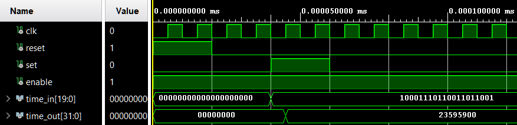
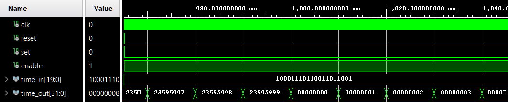
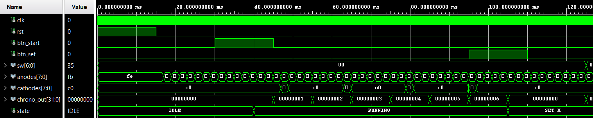
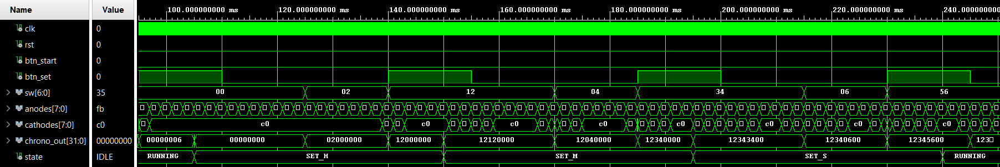
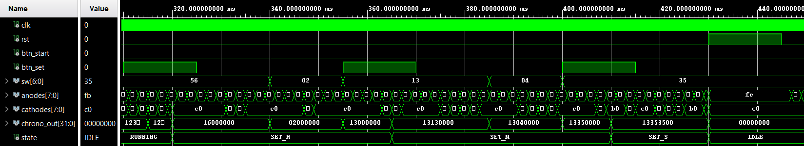
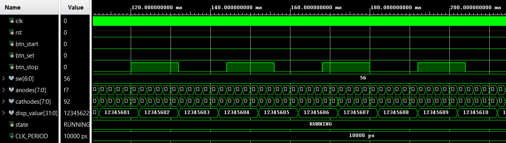
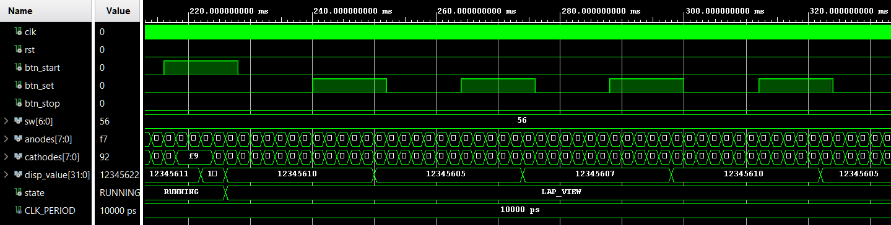
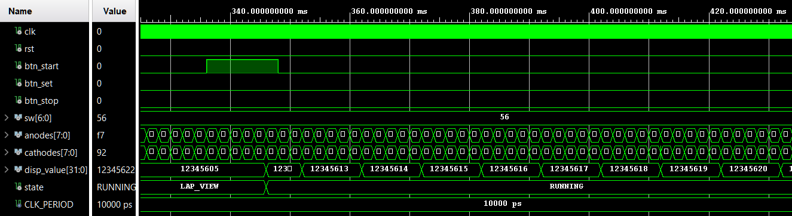

# Esercizio 5 – Cronometro

> Per una descrizione completa e formale del progetto fare riferimento alla documentazione:
>
> **Capitolo 2 – Reti sequenziali elementari, Esercizio 5**.

Questo esercizio prevede la progettazione e l’implementazione in **VHDL** di un **cronometro digitale** in grado di scandire ore, minuti, secondi e centesimi di secondo a partire dal clock della board.  
Il sistema è stato progettato utilizzando un approccio **strutturale**, collegando in cascata più contatori modulo-N.

---

# Esercizio 5.1 – Cronometro

## Obiettivo

Progettare e simulare un cronometro che:

* scandisca **ore, minuti e secondi** a partire dal clock di sistema
* consenta l’impostazione di un **tempo iniziale** tramite un segnale di **set**
* supporti un **reset** per azzerare il conteggio
* utilizzi un’architettura **strutturale basata su contatori**

---

## Architettura

Il cronometro è realizzato mediante una **catena di contatori modulo-N**, ognuno responsabile di una cifra del tempo.

Il formato del tempo è:

```
hh:mm:ss:cc
```

dove `cc` rappresenta i **centesimi di secondo**.

Ogni cifra è implementata tramite un’istanza del modulo parametrico:

```
counter_modN
```

che fornisce:

* il valore corrente della cifra
* un segnale `max_tick` attivo quando viene raggiunto il valore massimo

I contatori sono collegati **in cascata**, in modo che il completamento del conteggio di una cifra abiliti l’incremento della successiva.

Catena di incremento:

```
CU → CD → SU → SD → MU → MD → OU → OD
```

dove:

| Sigla | Significato |
|------|-------------|
| CU | centesimi unità |
| CD | centesimi decine |
| SU | secondi unità |
| SD | secondi decine |
| MU | minuti unità |
| MD | minuti decine |
| OU | ore unità |
| OD | ore decine |

---


## Funzionalità principali

Il modulo supporta le seguenti operazioni:

* **Enable**  
  abilita o sospende il conteggio del cronometro

* **Reset**  
  azzera tutte le cifre

* **Set**  
  consente di caricare un valore iniziale di **ore, minuti e secondi**

I centesimi di secondo vengono sempre inizializzati a zero.

---

## Rollover giornaliero

Il sistema è progettato per contare fino al valore massimo:

```
23:59:59:99
```

Al raggiungimento di questa configurazione viene generato un segnale di **fine giornata** (`end_of_day`), che provoca automaticamente il reset del cronometro riportandolo a:

```
00:00:00:00
```

Questo comportamento permette di utilizzare il sistema anche come **orologio a 24 ore**.

---

## Simulazione

La verifica funzionale è stata effettuata tramite un **testbench dedicato**, che applica diverse sequenze di stimolo agli ingressi del cronometro.

La simulazione verifica in particolare:

* il corretto funzionamento del **reset iniziale**
* il caricamento di un tempo tramite il segnale **set**
* il corretto avanzamento delle cifre
* il **rollover** da `23:59:59:99` a `00:00:00:00`

<p align="center">
  
</p>

<p align="center">
  
</p>

---

# Esercizio 5.2 – Implementazione su FPGA

## Obiettivo

Sintetizzare e implementare il cronometro sulla board **Nexys A7**, utilizzando:

* **display a 7 segmenti** per visualizzare il tempo
* **switch** per impostare il valore iniziale
* **pulsanti** per controllare il funzionamento del sistema

---

## Architettura del sistema

Il sistema completo è organizzato secondo una struttura **a due livelli**:

* **Unità Operativa (UO)**  
  gestisce il cronometro e la visualizzazione sui display
  

* **Unità di Controllo (UC)**  
  implementa la logica sequenziale che governa le modalità operative del sistema. L’unità di controllo è implementata come una **macchina a stati finiti (FSM)**.


---

## Interfaccia hardware

Il sistema utilizza le seguenti risorse della board:

* **Switch** → inserimento dei valori durante il set
* **Pulsante START** → avvio del cronometro
* **Pulsante SET** → ingresso e navigazione nella modalità di configurazione
* **Display a 7 segmenti** → visualizzazione del tempo

Per evitare problemi dovuti al rimbalzo dei pulsanti, i segnali vengono filtrati tramite moduli di **debouncing**.

---

## Simulazione del sistema completo

Il testbench del sistema verifica il comportamento dell’intero cronometro su board, simulando:

* reset iniziale
* avvio del cronometro
* ingresso nella modalità di configurazione
* impostazione di ore, minuti e secondi
* ripresa del conteggio
* reset durante le fasi operative

<p align="center">
  
</p>

<p align="center">
  
</p>

<p align="center">
  
</p>

---

# Esercizio 5.3 – Cronometro con Intertempi

> Per una descrizione completa e formale del progetto fare riferimento alla documentazione:
>
> **Capitolo 2 – Reti sequenziali elementari, Esercizio 5.3**.

Questo esercizio estende il cronometro realizzato nei punti precedenti introducendo la funzionalità di **memorizzazione e visualizzazione degli intertempi (laps)**.

Il sistema è implementato in **VHDL** ed è progettato per essere eseguito sulla **board Nexys A7**, utilizzando pulsanti, switch e display a 7 segmenti.

---

# Funzionalità principali

Il cronometro supporta le seguenti operazioni:

* **Avvio e arresto del conteggio**
* **Impostazione dell’orario iniziale** (ore, minuti, secondi)
* **Memorizzazione degli intertempi**
* **Visualizzazione sequenziale degli intertempi salvati**
* **Memoria circolare degli intertempi**

Alla pressione del pulsante `stop`, il valore corrente del cronometro viene salvato in una memoria interna.

È possibile memorizzare fino a **N intertempi**, definiti tramite parametro generico.

Se la memoria è piena, i nuovi intertempi **sovrascrivono ciclicamente quelli più vecchi**.

---

# Architettura

Il sistema è organizzato secondo una struttura modulare composta da due blocchi principali:

* **Unità di Controllo (UC)**  
  Gestisce la logica sequenziale del sistema tramite una **macchina a stati finiti (FSM)**.

* **Unità Operativa (UO)**  
  Implementa il cronometro, la memoria degli intertempi e la gestione del display.


---


# Simulazione

La verifica funzionale è stata effettuata tramite un **testbench dedicato** che istanzia il modulo principale del sistema e simula una sequenza completa di utilizzo.

La simulazione include le seguenti fasi:

* **reset iniziale del sistema**
* **configurazione del tempo iniziale** (es. `12:34:56`)
* **salvataggio di più intertempi**
* **test della memoria circolare** (scrittura di N+1 intertempi)
* **visualizzazione degli intertempi**
* **ritorno alla modalità cronometro**

I risultati confermano il corretto funzionamento del sistema.

---

### Salvataggio degli intertempi

<p align="center">
  
</p>

Durante lo stato **RUNNING**, la pressione del pulsante `stop` salva il tempo corrente nella memoria degli intertempi.

---

### Visualizzazione degli intertempi

<p align="center">
  
</p>

In modalità **LAP_VIEW**, il pulsante `set` consente di scorrere sequenzialmente gli intertempi salvati.

---

### Ritorno alla modalità cronometro

<p align="center">
  
</p>

Premendo `start`, il sistema ritorna allo stato **RUNNING**, riprendendo il conteggio dal valore precedente alla consultazione degli intertempi.

---

<video width="640" height="480" controls>
  <source src="./assets/Cronometro.mp4" type="video/mp4">
  Il tuo browser non supporta il tag video.
</video>

https://github.com/user-attachments/assets/5b1acc09-db5f-4614-a68c-6791b71a09cb

---

**Note**

* Il progetto è interamente sviluppato in **VHDL**.
* L’architettura utilizza un approccio **strutturale e modulare**.
* Per motivi accademici, i file sorgente VHDL non sono inclusi in questo repository pubblico.
