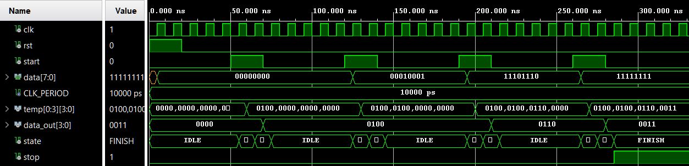
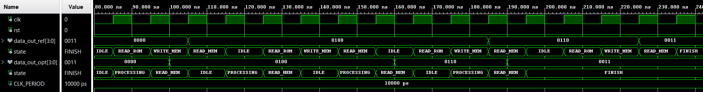
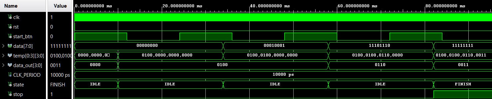

# Esercizio 6 – Sistema di lettura–elaborazione–scrittura PO–PC

> Per una descrizione completa e formale del progetto fare riferimento alla documentazione:
>
> **Capitolo 2 – Reti sequenziali elementari, Esercizio 6**.

Il progetto prevede la progettazione e l’implementazione in **VHDL** di un sistema sequenziale per la lettura, l’elaborazione e la scrittura di dati, basato su un’architettura **PO–PC (Parte Operativa – Parte di Controllo)**.

Il sistema legge sequenzialmente i dati da una memoria **ROM**, elabora ciascuna parola tramite una **macchina combinatoria M**, e memorizza il risultato in una memoria **MEM**. Il funzionamento è governato da un’unità di controllo realizzata come **FSM sincrona**.

---

## Architettura generale

Il sistema è suddiviso in due sottoblocchi principali:

- **Unità di Controllo (PC)**  
  Responsabile della generazione dei segnali di controllo e della corretta sequenzializzazione temporale delle operazioni.

- **Unità Operativa (PO)**  
  Contiene il percorso dati e realizza le operazioni di lettura dalla ROM, elaborazione combinatoria e scrittura/lettura dalla MEM.

Il modulo top-level realizza l’interconnessione esplicita tra PC e PO.

---

## Unità Operativa (PO)

L’Unità Operativa implementa il **datapath** del sistema ed è parametrizzata tramite **generic**, consentendo di modificare dimensione e larghezza delle memorie senza alterare la struttura del progetto.

Componenti principali:
- **ROM sincrona**: memoria di ingresso, letta una locazione alla volta
- **Macchina combinatoria M**: trasforma una parola a 8 bit in una parola a 4 bit
- **MEM sincrona**: memoria di destinazione dei risultati
- **Contatore modulo N**: genera gli indirizzi di accesso alle memorie

Flusso dei dati:
1. Lettura sincrona della ROM
2. Elaborazione combinatoria tramite M
3. Scrittura del risultato in MEM
4. Lettura sincrona della MEM per l’uscita

---

## Unità di Controllo (PC)

L’Unità di Controllo è realizzata come **FSM sincrona** e governa l’intero ciclo di elaborazione.

Per ridurre la latenza complessiva, è stata progettata una **versione ottimizzata** dell’Unità di Controllo, che permette di risparmiare **un ciclo di clock per ogni locazione elaborata**.

---

## Simulazione

La verifica funzionale è stata effettuata mediante **più testbench**, con i seguenti obiettivi:

- verificare il corretto funzionamento del sistema PO–PC;
- confrontare le versioni **originale** e **ottimizzata**;
- misurare il guadagno temporale introdotto dall’ottimizzazione.

### Testbench PO_PC ottimizzato
Il testbench applica:
- reset iniziale;
- pressioni sequenziali del segnale `START`;
- monitoraggio dei segnali `data_out` e `stop`.

La simulazione conferma:
- la corretta sequenza degli stati della FSM;
- l’aggiornamento coerente delle memorie;
- l’attivazione del segnale `stop` al termine della scansione.

  

---

### Confronto versione originale vs ottimizzata

Un testbench dedicato istanzia **entrambe le versioni** del sistema e applica stimoli simultanei.

Il confronto mostra chiaramente che la versione ottimizzata termina l’elaborazione con un anticipo pari a:

**NMEM · Tclk**

Nel caso in esame:
- NMEM = 4
- Tclk = 10 ns  
→ **guadagno totale: 40 ns**

  

---

## Implementazione su FPGA (Esercizio 6.2)

Il sistema è stato sintetizzato su board utilizzando:
- la **versione ottimizzata** della PC e della PO;
- un **debouncer hardware** per il pulsante di `START`;
- LED per la visualizzazione di `data_out` e del segnale `stop`.

La simulazione del modulo su board conferma il corretto funzionamento dell’intero sistema anche in presenza del debouncer hardware.

  

<video width="640" height="480" controls>
  <source src="./assets/PO_PC.mp4" type="video/mp4">
  Il tuo browser non supporta il tag video.
</video>

https://github.com/user-attachments/assets/4eddaf16-3987-46d1-a63f-7acc83f70c32

---

## Note

- Tutti i moduli sono implementati in **VHDL** con approccio modulare e gerarchico.
- Per motivi accademici, i file sorgente VHDL non sono inclusi in questo repository pubblico.

