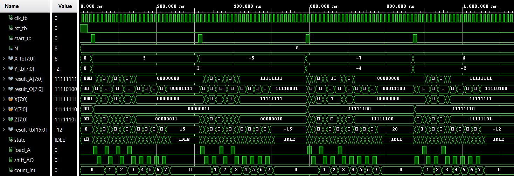
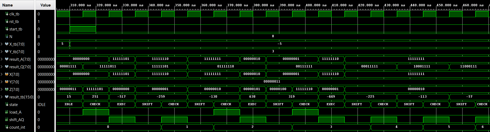
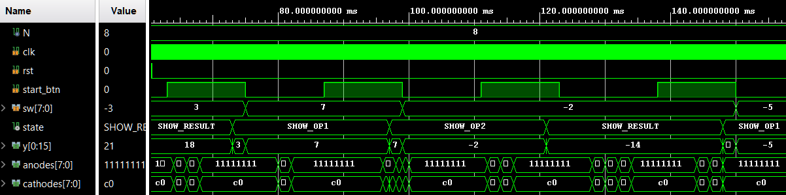
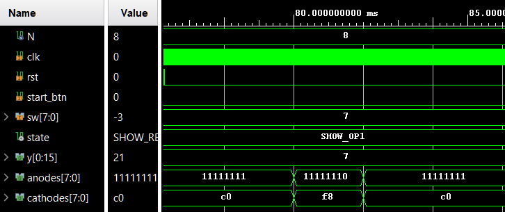
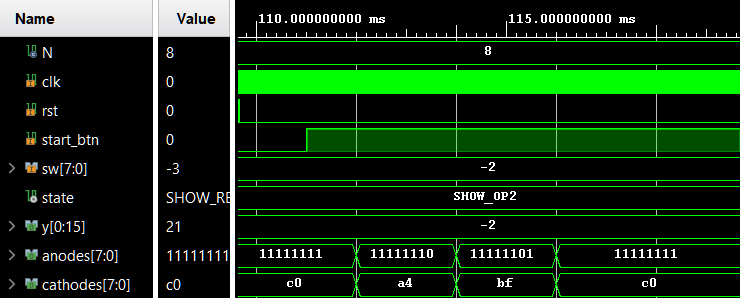
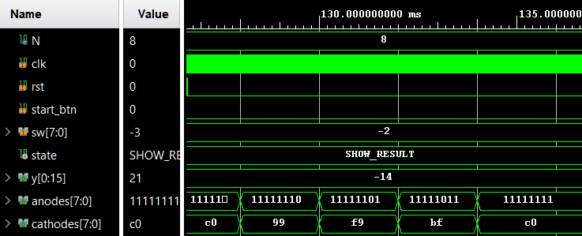

# Esercizio 7 – Moltiplicatore di Booth

> Per una descrizione completa e formale del progetto fare riferimento alla documentazione:
>
> **Capitolo 3 – Macchine aritmetiche, Esercizio 7**.

Questo esercizio prevede la progettazione, l’implementazione in **VHDL** e la verifica tramite simulazione di un **moltiplicatore sequenziale basato sull’algoritmo di Booth**.

Il sistema è in grado di effettuare il prodotto tra **due operandi signed da 8 bit** rappresentati in **complemento a due**, producendo un risultato su **16 bit**.

---

# Architettura

Il moltiplicatore è organizzato secondo una classica architettura a **controllo separato**, composta da due blocchi principali:

- **Unità di Controllo (UC)**  
- **Unità Operativa (UO)**

L’unità operativa implementa il **datapath aritmetico**, mentre l’unità di controllo gestisce la sequenza delle operazioni tramite una **macchina a stati finiti (FSM)**.

Il modulo principale è parametrizzato tramite il generico:

| Parametro | Significato |
|-----------|-------------|
| `N` | larghezza degli operandi |

Nel contesto dell’esercizio è impostato a **N = 8**.

### Interfaccia del modulo

| Segnale | Descrizione |
|-------|-------------|
| `clk` | clock di sistema |
| `rst` | reset sincrono |
| `start` | avvio della moltiplicazione |
| `X` | primo operando (N bit) |
| `Y` | secondo operando (N bit) |
| `result` | risultato della moltiplicazione (2N bit) |

Il risultato finale corrisponde alla concatenazione dei registri interni **A** e **Q** al termine delle iterazioni dell’algoritmo.

---

# Unità Operativa

L’unità operativa implementa il **datapath del moltiplicatore di Booth** e realizza le operazioni aritmetiche e gli shift richiesti dall’algoritmo.

I blocchi principali che compongono la UO sono:

- registro del **moltiplicando Y**
- **adder/subtractor** per somma o sottrazione
- registri di shift **A** e **Q**
- contatore delle iterazioni
- flip-flop per il bit **Q-1**

---

# Unità di Controllo

L’unità di controllo implementa una **macchina a stati finiti sincrona** che gestisce la sequenza delle operazioni dell’algoritmo di Booth.

La FSM riceve come ingressi:

- `start`
- `Q0`
- `Q_1`
- `count_out`

e genera i segnali di controllo per la UO

---

# Simulazione

Per verificare il corretto funzionamento del moltiplicatore è stato sviluppato un **testbench dedicato** (`Booth_Multiplier_tb`).

La simulazione utilizza:

- **operandi a 8 bit**
- **clock con periodo di 10 ns**
- **reset iniziale** per portare il sistema in uno stato noto

Il segnale `start` viene attivato per **un singolo ciclo di clock** per avviare l’esecuzione dell’algoritmo.

Sono stati testati diversi scenari per verificare la corretta gestione dei numeri signed in complemento a due:

| Test | Operazione |
|----|-------------|
| 1 | `5 × 3 = 15` |
| 2 | `-5 × 3 = -15` |
| 3 | `-7 × -4 = 28` |
| 4 | `6 × -2 = -12` |

Il risultato prodotto dal moltiplicatore viene confrontato con il valore atteso interpretando l’uscita come numero **signed a 2N bit**.

  

  

I risultati della simulazione confermano il corretto funzionamento del moltiplicatore per tutti i casi di test considerati.

---

# Implementazione su FPGA (Esercizio 7.2)

Nel secondo punto dell’esercizio il moltiplicatore è stato sintetizzato su **FPGA** e integrato con i dispositivi di input/output della board.

Il sistema utilizza:

- **switch** per inserire gli operandi
- **pulsante start** per confermare l’acquisizione
- **display a 7 segmenti** per la visualizzazione dei dati

Il comportamento del sistema replica quello di una **calcolatrice a due operandi**:

1. inserimento del primo operando
2. conferma tramite `start`
3. inserimento del secondo operando
4. avvio della moltiplicazione
5. visualizzazione del risultato

---

# Simulazione del sistema su board

È stato realizzato un testbench (`Booth_Multiplier_on_board_tb`) che simula il comportamento dell’utente tramite:

- switch per l’inserimento degli operandi
- pressione del pulsante `start`

Sono stati verificati i seguenti casi:

| Test | Operazione |
|----|-------------|
| 1 | `6 × 3 = 18` |
| 2 | `7 × -2 = -14` |
| 3 | `-5 × 4 = -20` |
| 4 | `-7 × -3 = 21` |

Le forme d’onda confermano la corretta acquisizione degli operandi e la corretta visualizzazione del risultato.

  

  

  

  

<video width="640" height="480" controls>
  <source src="./assets/Booth.mp4" type="video/mp4">
  Il tuo browser non supporta il tag video.
</video>

https://github.com/user-attachments/assets/5f9914ad-e451-4ae7-a102-a4c1e02d69f9

---

**Note**

- Il progetto è interamente sviluppato in **VHDL**.
- L’architettura segue un approccio **modulare con separazione UC/UO**.
- Il sistema implementa completamente l’**algoritmo sequenziale di Booth** per la moltiplicazione di numeri signed.
- Per motivi accademici, i file sorgente VHDL non sono inclusi in questo repository pubblico.
