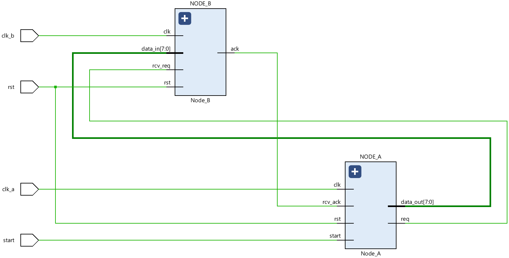
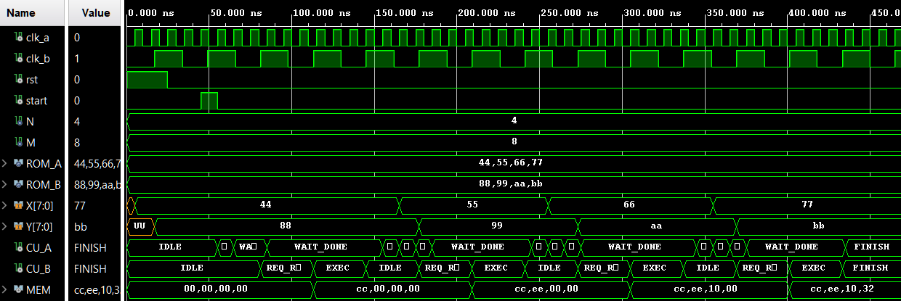
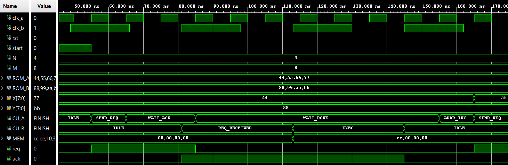
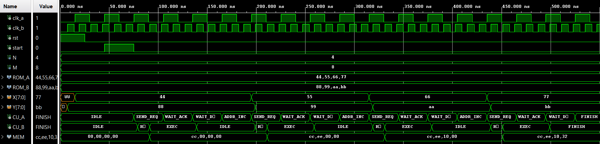
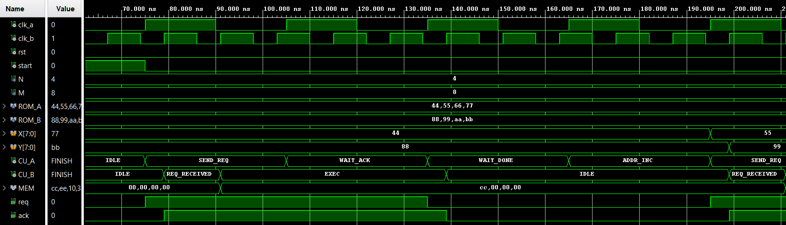

# Comunicazione con Handshaking

> Per una descrizione completa e formale del progetto fare riferimento alla documentazione:
>
> **Capitolo 4 – Comunicazione con handshaking, Esercizio 8**

---

# Esercizio 8 – Comunicazione con Handshaking

## Obiettivo

Progettare, implementare in **VHDL** e verificare tramite **simulazione** un sistema composto da **due nodi A e B** che comunicano mediante **protocollo di handshaking**.

Entrambi i nodi possiedono una memoria interna contenente:

* nodo **A** → stringhe `X(i)`
* nodo **B** → stringhe `Y(i)`

con:

* `i = 0 .. N-1`
* stringhe di **M bit**

Il funzionamento del sistema è il seguente:

1. Il nodo **A** trasmette la stringa `X(i)` al nodo **B**
2. Il nodo **B** riceve il dato
3. Calcola la somma `S(i) = X(i) + Y(i)`

4. Memorizza il risultato nella propria memoria.

Per scandire le operazioni sono utilizzati **contatori espliciti** in entrambi i nodi.

---

# Protocollo di Handshaking

Il protocollo utilizza due segnali:

| Segnale | Funzione |
|------|-----------|
| `REQ` | richiesta di trasmissione |
| `ACK` | conferma di ricezione |

Sequenza del protocollo:

1. il trasmettitore pone il dato sul bus
2. attiva `REQ`
3. il ricevente acquisisce il dato
4. il ricevente attiva `ACK`
5. il trasmettitore disattiva `REQ`
6. il ricevente disattiva `ACK`

Questo schema evita la perdita dei dati garantendo che ogni trasferimento venga **completato prima dell’invio del successivo**.

---

# Architettura del sistema

Il sistema è composto da due moduli:

* **Nodo A** – trasmettitore
* **Nodo B** – ricevitore ed elaboratore

Entrambi sono organizzati secondo la classica separazione:

* **Unità di Controllo (CU)**
* **Unità Operativa (OU)**

Parametri del sistema:

| parametro | significato |
|----------|-------------|
| `N` | numero di stringhe |
| `M` | bit per stringa |

Sono presenti due clock distinti:

* `clk_a`
* `clk_b`

per modellare una comunicazione **potenzialmente asincrona**.

Comunicazione tra i nodi:

* `req`
* `ack`
* `data[M-1:0]`

---

# Nodo A – Trasmettitore

Il nodo A:

* legge le stringhe `X(i)` dalla ROM
* le invia al nodo B
* controlla il protocollo di handshaking

---

# Nodo B – Ricevitore ed elaboratore

Il nodo B:

1. riceve il dato da A
2. legge `Y(i)` dalla propria ROM
3. calcola `S(i) = X(i) + Y(i)`
4. salva il risultato nella memoria dei risultati.

---

# Macchine a stati (FSM)

Il protocollo è gestito da due FSM:

* **Control Unit A**
* **Control Unit B**

---

# Simulazione

Per verificare il comportamento del protocollo sono stati sviluppati **due testbench**, simulando condizioni asincrone tra i clock.

I clock dei due nodi sono:

* **sfasati di 2 ns**
* con **frequenze differenti**

Questo permette di simulare una comunicazione tra **domini di clock diversi**.

---

# Caso 1 – Nodo A più veloce

Periodo dei clock:

| Nodo | Periodo |
|-----|---------|
| A | `10 ns` |
| B | `30 ns` |

Il trasmettitore è quindi **3 volte più veloce** del ricevente.

Il protocollo garantisce che il dato rimanga stabile sul bus finché `ACK` non viene ricevuto.

Sequenza completa:

REQ ↑
ACK ↑
REQ ↓
ACK ↓

---

# Caso 2 – Nodo B più veloce

Periodo dei clock:

| Nodo | Periodo |
|-----|---------|
| A | `30 ns` |
| B | `10 ns` |

In questo caso il **ricevente è più veloce** del trasmettitore.

Anche in questa configurazione il protocollo evita:

* campionamenti ripetuti
* perdita di dati
* transizioni premature degli stati.

---

# Conclusioni

Le simulazioni dimostrano che il protocollo di handshaking implementato:

* garantisce **trasmissione corretta dei dati**
* funziona con **clock differenti**
* tollera **sfasamenti temporali**

Il ciclo:

`REQ ↑ → ACK ↑ → REQ ↓ → ACK ↓`

assicura la sincronizzazione logica tra i due nodi senza l’utilizzo di un segnale aggiuntivo `DONE`.

---

## Note

* Il progetto è sviluppato interamente in **VHDL**
* Architettura modulare con separazione **UC / UO**
* Comunicazione asincrona basata su protocollo **REQ/ACK**
* Per motivi accademici, i file sorgente VHDL non sono inclusi in questo repository pubblico.