# Processore MIC-1 e IJVM

> Per una descrizione completa e formale del progetto fare riferimento alla documentazione:
>
> **Capitolo 5 – Processore, Esercizio 9**

---

# Esercizio 9 – Processore IJVM su MIC-1

## Obiettivo

A partire dall’implementazione fornita del processore **MIC-1** operante secondo il modello **IJVM**, l’obiettivo dell’esercizio è:

* analizzare il funzionamento dell’architettura tramite **simulazione**
* studiare nel dettaglio **due istruzioni IJVM**
* modificare il set di istruzioni introducendo una **nuova operazione**

---

# Architettura del sistema

Il processore MIC-1 è una **macchina microprogrammata** che esegue programmi IJVM tramite un **interprete scritto in microcodice (MAL)**.

Il funzionamento si basa su un ciclo principale di tipo:

`
fetch → decode → execute
`

Microistruzione principale:

```
main:
PC = PC + 1; fetch; goto (MBR)
```

Funzioni:

* incremento del **Program Counter (PC)**
* fetch del byte successivo
* salto alla microsequenza associata all’opcode

---

# Analisi delle istruzioni

Sono state analizzate due istruzioni IJVM:

* `IINC` → incremento di variabile locale
* `IF_ICMPEQ` → confronto e salto condizionale

---

# Istruzione 1 – IINC

L’istruzione `IINC` (opcode `0x84`) implementa un’operazione di aggiornamento diretto su una variabile locale, incrementandone il valore mediante una costante con segno.

| Codice | Mnemonico | Significato |
|--------|----------|------------|
| `0x84` | `IINC varnum const` | Somma la costante `const` alla variabile locale indirizzata da `varnum` |

* `varnum` → offset della variabile nell’area delle variabili locali (puntata da `LV`)
* `const` → valore immediato a 8 bit con segno


---


## Microcodice

```
iinc = 0x84:

    H = LV
    MAR = MBRU + H; rd
    PC = PC + 1; fetch
    H = MDR
    PC = PC + 1; fetch
    MDR = MBR + H; wr; goto main
```

## Datapath (micro-operazioni)

<table align="center">
  <tr>
    <td align="center">
      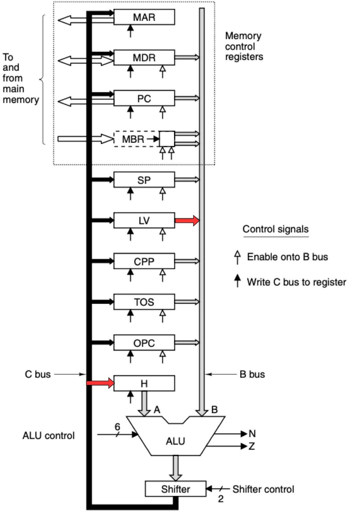<br>
      <b>H = LV</b>
    </td>
    <td align="center">
      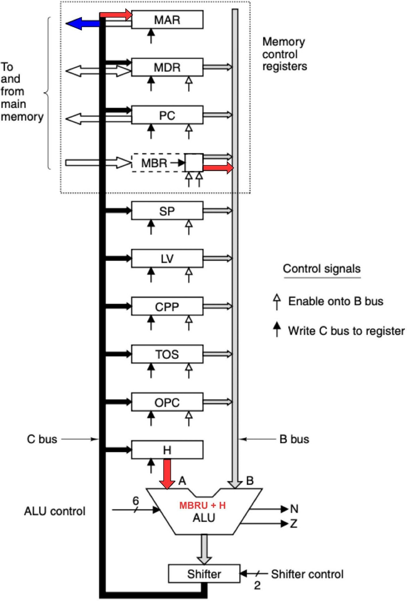<br>
      <b>MAR = MBRU + H; rd</b>
    </td>
  </tr>
</table>

<br>

<table align="center">
  <tr>
    <td align="center">
      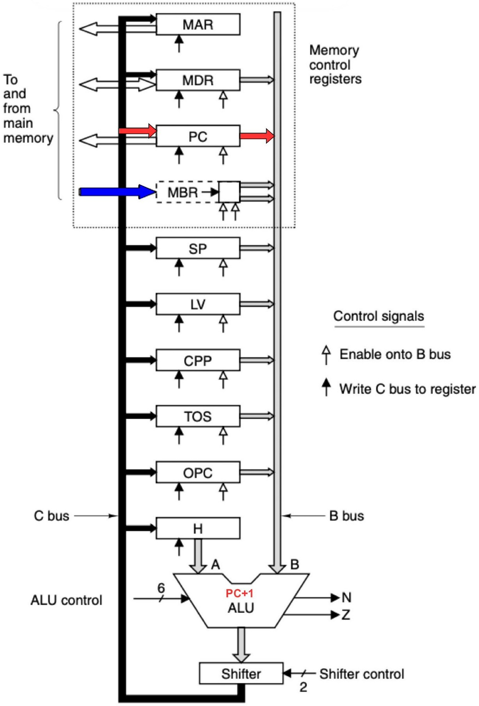<br>
      <b>PC = PC + 1; fetch</b>
    </td>
    <td align="center">
      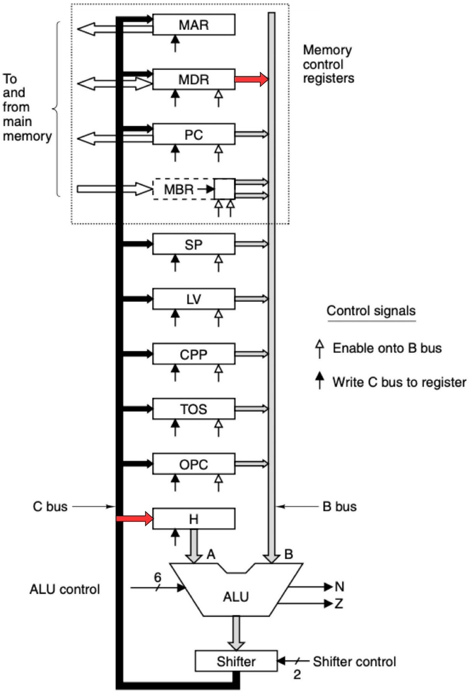<br>
      <b>H = MDR</b>
    </td>
  </tr>
</table>

<br>

<table align="center">
  <tr>
    <td align="center">
      <br>
      <b>PC = PC + 1; fetch</b>
    </td>
    <td align="center">
      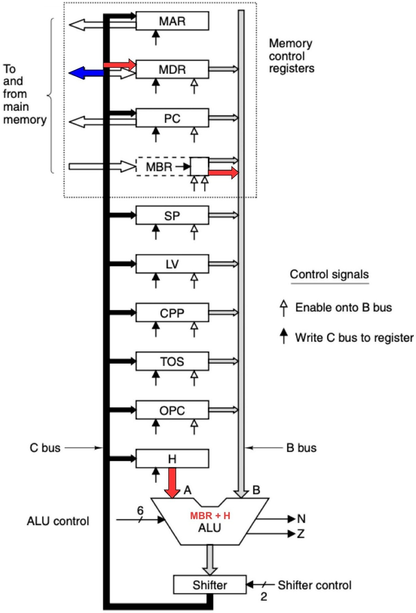<br>
      <b>MDR = MBR + H; wr</b>
    </td>
  </tr>
</table>


## Simulazione

Programma di test:

```
BIPUSH 0xA
ISTORE a
IINC a 5
HALT
```

<p align="center">
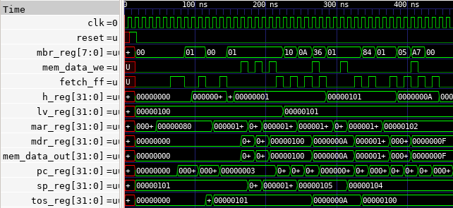
</p>

---

# Istruzione 2 – IF_ICMPEQ

L’istruzione `IF_ICMPEQ` (opcode `0xA1`) confronta due valori interi presenti in cima allo stack ed esegue un salto condizionale.

| Codice | Mnemonico | Significato |
|--------|----------|------------|
| `0xA1` | `IF_ICMPEQ offset` | Confronta due valori e salta se sono uguali |

* `offset` → valore immediato a 16 bit con segno (branch relativo)

---

## Microcodice

```
if_icmpeq = 0xA1:

    MAR = SP = SP - 1; rd
    MAR = SP = SP - 1
    H = MDR; rd
    OPC = TOS
    TOS = MDR
    Z = OPC - H; if (Z) goto T; else goto F

    T:
    OPC = PC - 1; fetch; goto goto_cont

    F:
    PC = PC + 1
    PC = PC + 1; fetch
    goto main
```

---

## Datapath (micro-operazioni)

<table align="center">
  <tr>
    <td align="center">
      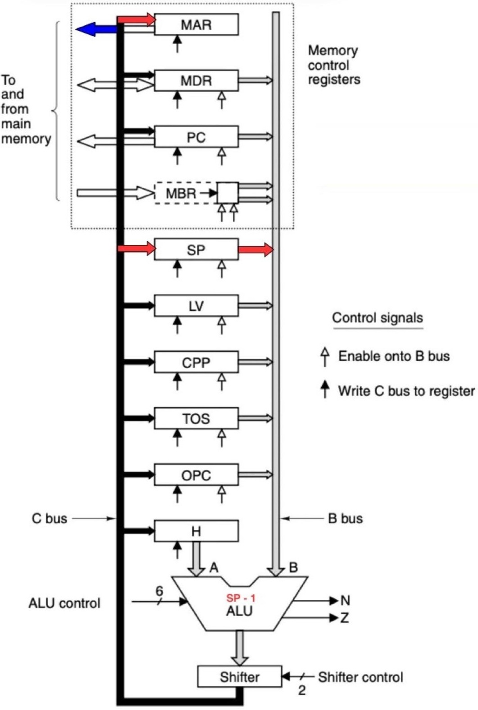<br>
      <b>MAR = SP = SP - 1; rd</b>
    </td>
    <td align="center">
      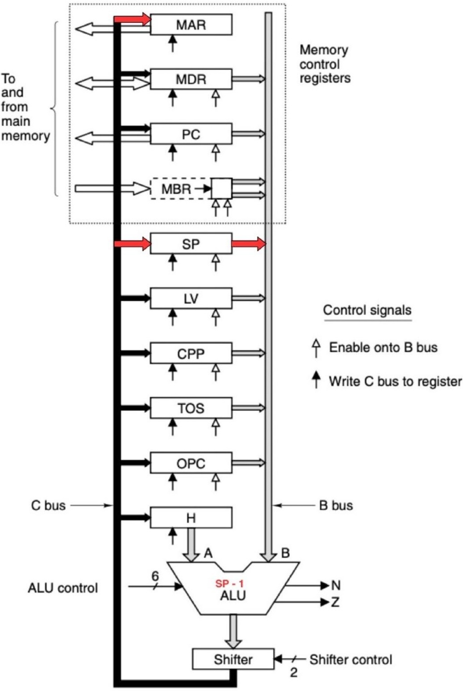<br>
      <b>MAR = SP = SP - 1</b>
    </td>
  </tr>
</table>

<br>

<table align="center">
  <tr>
    <td align="center">
      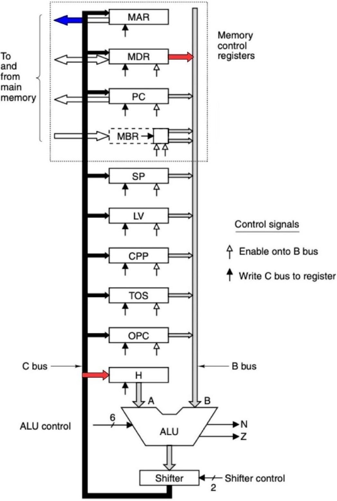<br>
      <b>H = MDR; rd</b>
    </td>
    <td align="center">
      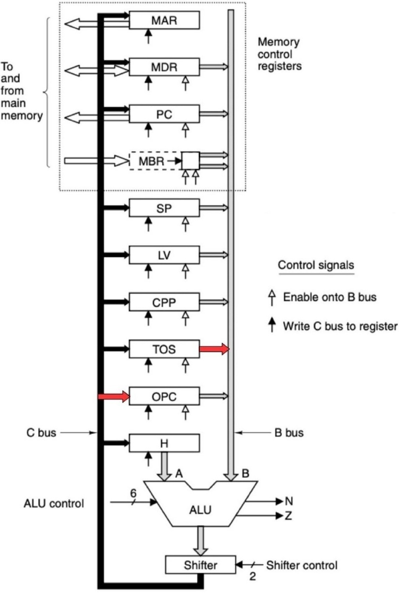<br>
      <b>OPC = TOS</b>
    </td>
  </tr>
</table>

<br>

<table align="center">
  <tr>
    <td align="center">
      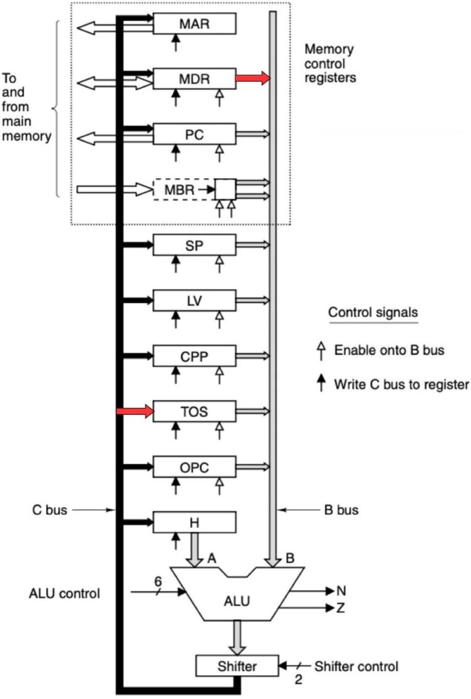<br>
      <b>TOS = MDR</b>
    </td>
    <td align="center">
      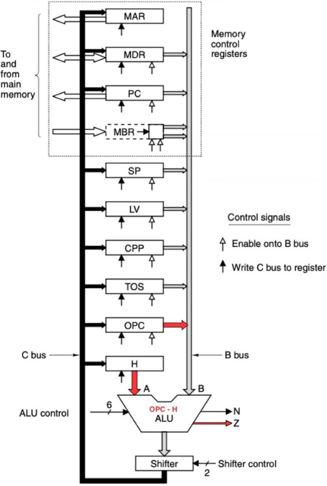<br>
      <b>Z = OPC - H</b>
    </td>
  </tr>
</table>

---

### Caso salto (branch preso)

<table align="center">
  <tr>
    <td align="center">
      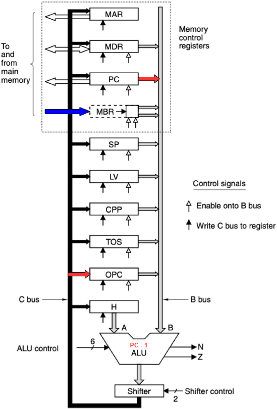<br>
      <b>OPC = PC - 1; fetch; goto goto_cont</b>
    </td>
  </tr>
</table>

---

### Caso no salto

<table align="center">
  <tr>
    <td align="center">
      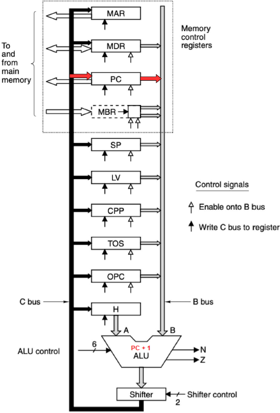<br>
      <b>PC = PC + 1</b>
    </td>
    <td align="center">
      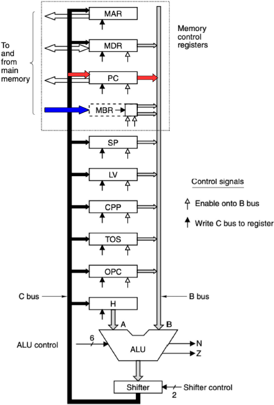<br>
      <b>PC = PC + 1; fetch</b>
    </td>
  </tr>
</table>

---

## Simulazione

Programma di test:

```
BIPUSH 5
BIPUSH 5
IF_ICMPEQ EQUAL

BIPUSH 0
GOTO SAVE

EQUAL:
BIPUSH 1

SAVE:
ISTORE a
HALT
```

<p align="center">
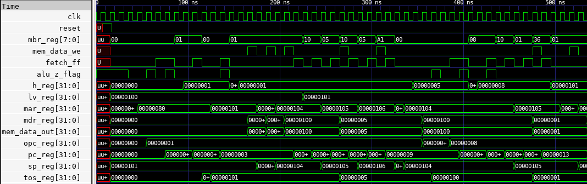
</p>

---

# Estensione del set di istruzioni

## Nuova istruzione – IABS

È stata introdotta una nuova istruzione:

`
IABS
`

L’istruzione `IABS` (opcode `0x27`) calcola il valore assoluto del dato in cima allo stack.

---

### Tabella riassuntiva

| Codice | Mnemonico | Significato |
|--------|----------|------------|
| `0x27` | `IABS` | Calcola il valore assoluto dell’intero in cima allo stack |

---

## Microcodice

```
iabs = 0x27:

    H = TOS; if (N) goto NEG; else goto POS

    POS:
    goto main

    NEG:
    MAR = SP
    MDR = TOS = -H; wr; goto main
```
## Funzionamento

* se il valore è **positivo o nullo** → nessuna modifica
* se il valore è **negativo** → viene calcolato l’opposto
* il risultato aggiorna:
  * `TOS`
  * la memoria dello stack

---

# Simulazione IABS

Programma di test:

```
BIPUSH 0x0A
IABS
BIPUSH 0xFB
IABS
ISTORE a
HALT
```

---

## Risultato

* `10 → 10`
* `-5 → 5`

---

<p align="center">
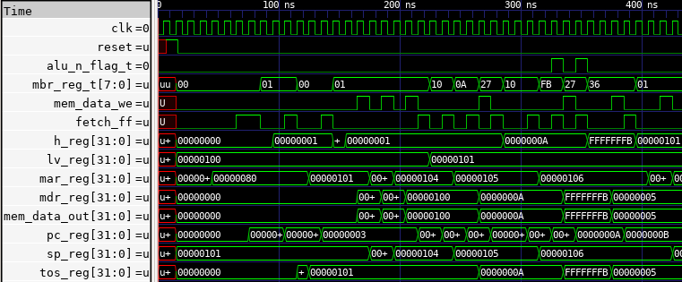
</p>

---

# Conclusioni

L’analisi e le simulazioni mostrano che:

* il processore MIC-1 esegue correttamente istruzioni IJVM
* il microcodice controlla in modo preciso:
  * accessi memoria
  * operazioni ALU
  * flusso di controllo
* l’architettura è **estensibile**, permettendo l’aggiunta di nuove istruzioni

La nuova istruzione `IABS` dimostra:

* corretto utilizzo dei flag ALU
* integrazione completa nel flusso IJVM
* compatibilità con l’interprete esistente

---

## Note

* Progetto sviluppato su architettura **MIC-1**
* Interprete basato su **microcodice MAL**
* Simulazioni effettuate tramite **testbench dedicati**