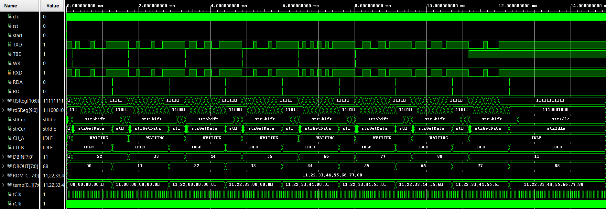
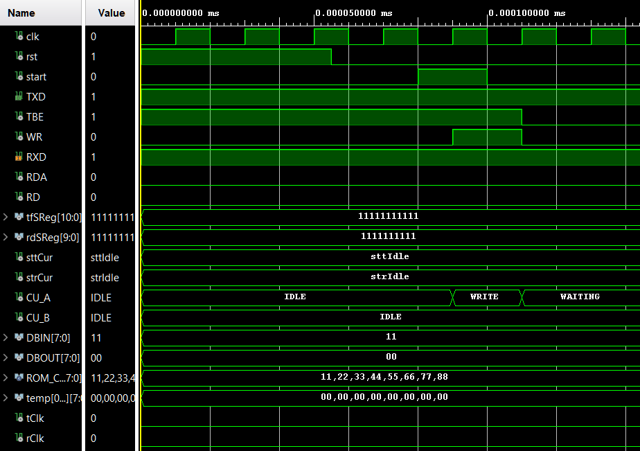
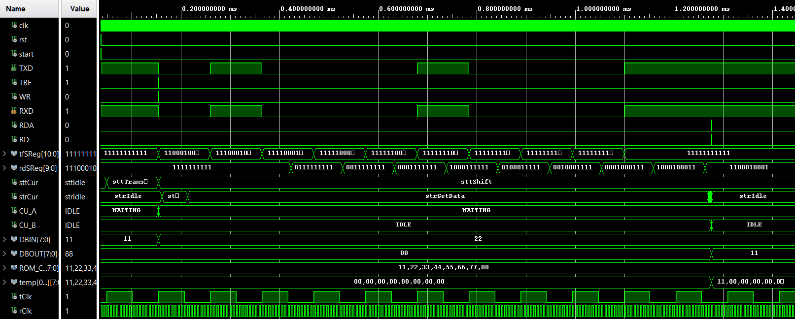
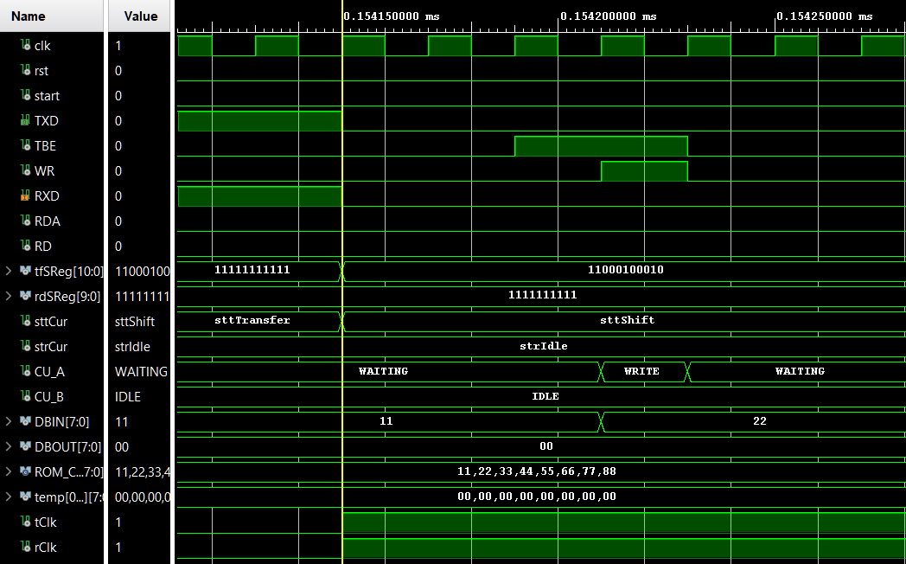
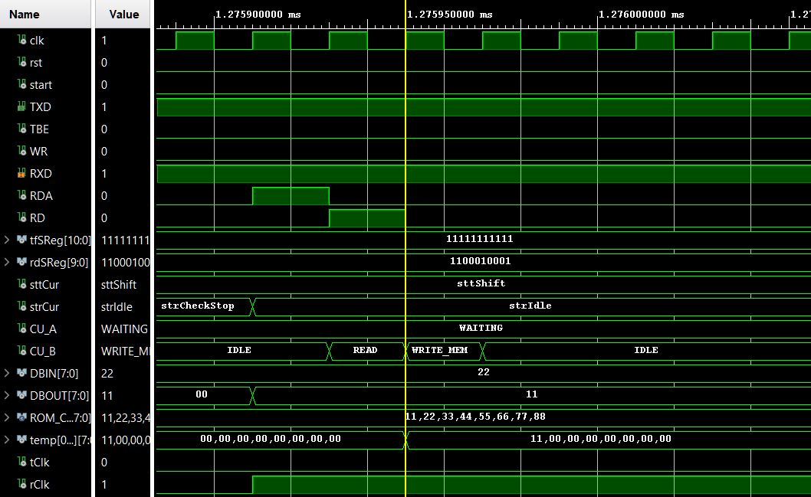

# Esercizio 10 – Comunicazione Seriale UART

> Per una descrizione completa e formale del progetto fare riferimento alla documentazione:
>
> **Capitolo 6 – Interfaccia seriale, Esercizio 10**.

Questo esercizio prevede la progettazione, l’implementazione in **VHDL** e la verifica tramite simulazione di un sistema di **comunicazione seriale UART** tra due nodi A e B.

Il sistema è in grado di trasmettere **byte da 8 bit** dalla ROM del nodo A alla MEM del nodo B utilizzando l’interfaccia seriale RS232.  

---

# Architettura

Il sistema è organizzato secondo una classica architettura a **controllo separato**, composta da due blocchi principali per ciascun nodo:

- **Unità di Controllo (UC)**  
- **Unità Operativa (UO)**

L’unità operativa gestisce la trasmissione e la ricezione dei byte tramite UART, mentre l’unità di controllo coordina la sequenza di invio e ricezione dei dati tramite **macchine a stati finiti (FSM)**.

Il modulo principale è parametrizzato tramite il generico:

| Parametro | Significato |
|-----------|-------------|
| `N` | numero di byte da trasmettere |

Nel contesto dell’esercizio è impostato a **N = 8**.

---

# Unità Operativa – Nodo A (Trasmettitore)

L’unità operativa del nodo A gestisce il **datapath per la trasmissione seriale** dei byte dalla ROM.

I blocchi principali della UO sono:

- **ROM** → contiene i byte da trasmettere
- **CONT_A** → scandisce gli indirizzi ROM
- **UART_A** → trasmettitore seriale

---

# Unità Operativa – Nodo B (Ricevitore)

L’unità operativa del nodo B gestisce la **ricezione dei byte seriali** e la memorizzazione in MEM interna.

I blocchi principali della UO sono:

- **UART_B** → ricevitore seriale
- **MEM** → memorizza i byte ricevuti
- **CONT_B** → scandisce gli indirizzi MEM

---

# Unità di Controllo – Nodo A

L’unità di controllo implementa una **FSM sincrona** che coordina l’invio dei byte.

---

# Unità di Controllo – Nodo B

L’unità di controllo del nodo B implementa una FSM che coordina la lettura dei byte ricevuti e la scrittura in MEM.

---

# Simulazione

Per verificare il corretto funzionamento del sistema è stato sviluppato un **testbench dedicato** (`Serial_UART_tb`).

La simulazione utilizza:

- clock di **20 ns**
- reset iniziale per portare il sistema in uno stato noto
- segnale `start` attivato per un singolo ciclo per avviare la trasmissione dei byte

Sono stati testati tutti gli 8 byte presenti nella ROM del nodo A.

  

## Preparazione primo byte:

  

## Trasmissione completa primo byte

  

### Inizio trasmissione primo byte

  

### Fine trasmissione primo byte

  

---

**Note**

- Il progetto è interamente sviluppato in **VHDL**.
- L’architettura segue un approccio **modulare con separazione UC/UO**.
- Per motivi accademici, i file sorgente VHDL non sono inclusi in questo repository pubblico.