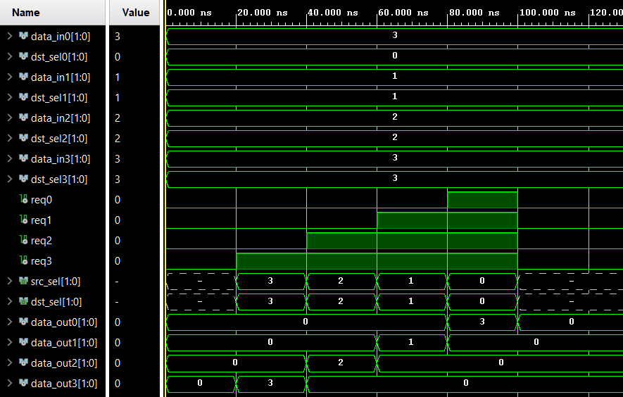

# Esercizio 11 – Switch multistadio - Omega Network

> Per una descrizione completa e formale del progetto fare riferimento alla documentazione:
>
> **Capitolo 7 – Switch multistadio, Esercizio 11**.

Questo esercizio prevede la progettazione, l’implementazione in **VHDL** e la verifica tramite simulazione di uno **switch multistadio** basato su **Omega Network**.  
Il sistema è in grado di instradare pacchetti di **2 bit** tra 4 nodi sorgente e 4 nodi destinazione, implementando una **priorità fissa decrescente** tra i nodi (nodo0 > nodo1 > nodo2 > nodo3).  

---

# Architettura

Il progetto è modulare e suddiviso in due blocchi principali:

- **Arbitro Globale** → gestisce la priorità dei pacchetti
- **Rete Omega Multistadio** → instrada i pacchetti verso le destinazioni corrette

L’**arbitro globale** seleziona quale nodo può trasmettere in base alla priorità fissa:

| Nodo | Priorità |
|------|----------|
| nodo0 | più alta |
| nodo1 | alta |
| nodo2 | bassa |
| nodo3 | più bassa |

La logica combinatoria può essere espressa come:

```
S0 = req0  
S1 = req1 AND NOT req0  
S2 = req2 AND NOT req0 AND NOT req1  
S3 = req3 AND NOT req0 AND NOT req1 AND NOT req2
```

Dove `S0–S3` determinano quale nodo sorgente viene selezionato.  
I segnali generati dall’arbitro (`src_sel` e `dst_sel`) vengono passati alla rete Omega per instradare correttamente i pacchetti.

---

La **rete Omega** collega 4 ingressi a 4 uscite tramite 2 stadi intermedi (`log2(4) = 2`).  
Ogni stadio è composto da **switch elementari**, costituiti da un `mux_2_1` seguito da un `demux_1_2`, che implementano il **perfect shuffling**.

---

# Simulazione

Il testbench `Multistage_Switch_tb` genera stimoli sequenziali per verificare:

- corretta assegnazione della priorità dall’Arbiter
- instradamento dei pacchetti nella rete Omega
- comportamento degli switch elementari

La simulazione attiva le richieste in ordine crescente di priorità (`req3 → req0`) e osserva le uscite `data_out0–data_out3`.


<p align="center">  </p>

Le forme d’onda confermano la corretta gestione della priorità fissa e dell’instradamento dei pacchetti.

---

**Note**

- Il progetto è interamente sviluppato in **VHDL**.
- Architettura modulare e scalabile per reti con più nodi.
- Per motivi accademici, i file sorgente VHDL non sono inclusi in questo repository pubblico.
