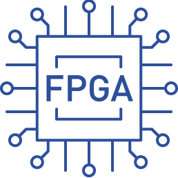

# 🔌 Digital Systems Architecture – VHDL Projects

Collection of **VHDL projects** developed for a Digital Systems Architecture course (2023/2024).  
The work covers the design, analysis, and verification of digital systems with increasing complexity—from basic combinational logic to processors, communication protocols, and multistage switching networks.

Projects were developed using **Xilinx Vivado** and validated through simulation and synthesis on **Digilent Nexys A7 FPGA (Artix-7)**.

---

## 🌍 Language

- Main documentation: 🇮🇹 Italian  
- Overview and project description: 🇬🇧 English  

---

## 🛠️ Technologies

<table>
  <tr>
    <td align="center">
      <br>
      VHDL
    </td>
    <td align="center">
      <a href="https://www.xilinx.com/products/design-tools/vivado.html" target="_blank">
        <br>
        Vivado
      </a>
    </td>
    <td align="center">
      <a href="https://digilent.com/" target="_blank">
        <br>
        Digilent
      </a>
    </td>
    <td align="center">
      <br>
      FPGA
    </td>
  </tr>
</table>

---

## 🧩 Contents

Projects are organized in progressive modules:

1. [**Basic Combinational Networks**](./C1_reti_combinatorie)  
   (Reti combinatorie elementari)  
   Design and VHDL description of combinational logic networks.

2. [**Sequential Networks**](./C2_reti_sequenziali)  
   (Reti sequenziali elementari)  
   Design of synchronous systems such as sequence detectors, shift registers, and timers.

3. [**Arithmetic Units**](./C3_macchine_aritmetiche)  
   (Macchine aritmetiche)  
   Implementation of a Booth multiplier.

4. [**Handshaking Communication**](./C4_handshaking)  
   (Comunicazione con handshaking)  
   Design of asynchronous communication protocols based on request/acknowledge signals.

5. [**Processor Design**](./C5_processore)  
   (Processore)  
   Analysis and modification of a processor based on the IJVM model (Mic-1 architecture).

6. [**Serial Interface**](./C6_interfaccia_seriale)  
   (Interfaccia seriale)  
   Design and simulation of a UART-based serial communication system.

7. [**Multistage Switch**](./C7_switch_multistadio)  
   (Switch multistadio)  
   Design and implementation of multistage switching architectures based on Omega Network.

---

## 📁 Repository Structure


```
Digital-Systems-Architecture-VHDL-Projects-Public
│
├── C1_reti_combinatorie
│   ├── E1_rete_di_interconnessione_16_4
│   └── E2_Sistema_ROM_M
│
├── C2_reti_sequenziali
│   ├── E3_Riconoscitore_di_sequenze
│   ├── E4_Shift_register
│   ├── E5_Cronometro
│   └── E6_Sistema_di_lettura-elaborazione-scrittura
│
├── C3_macchine_aritmetiche
│   └── E7_Moltiplicatore_di_Booth
│
├── C4_handshaking
│   └── E8_Comunicazione_con_Handshaking
│
├── C5_processore
│   └── E9_Processore_Mic-1
│
├── C6_interfaccia_seriale
│   └── E10_Sistema_di_Comunicazione_Seriale
│
├── C7_switch_multistadio
│   └── E11_Omega_Network
│
├── assets
│
└── README.md
```

## 🎓 Notes

This repository has **educational purposes** and was developed within a university course.  
The projects are not optimized for industrial use but aim to consolidate the fundamental concepts of digital systems architecture.

For academic reasons, <u>VHDL source files and full documentation are not included in this public repository</u>.
